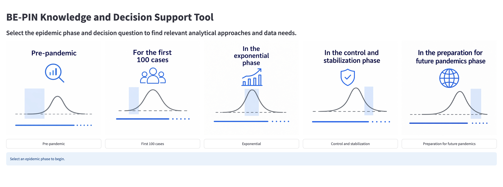
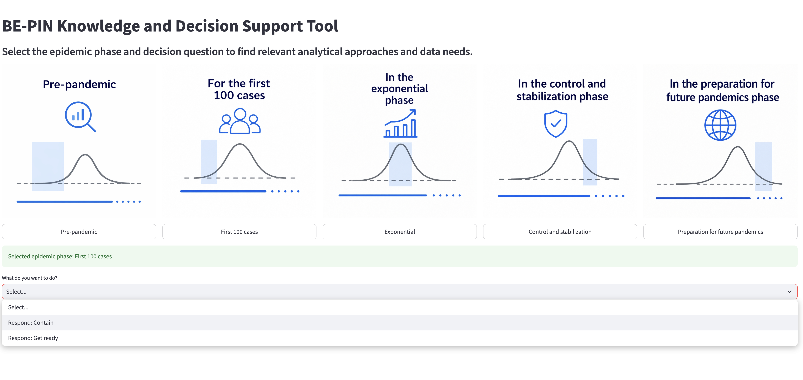
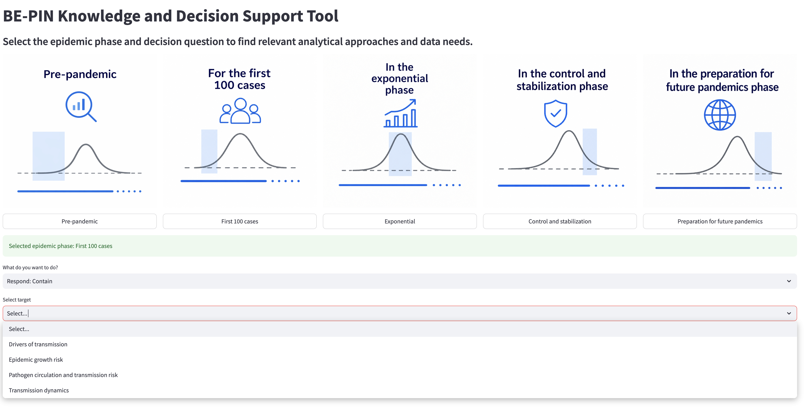
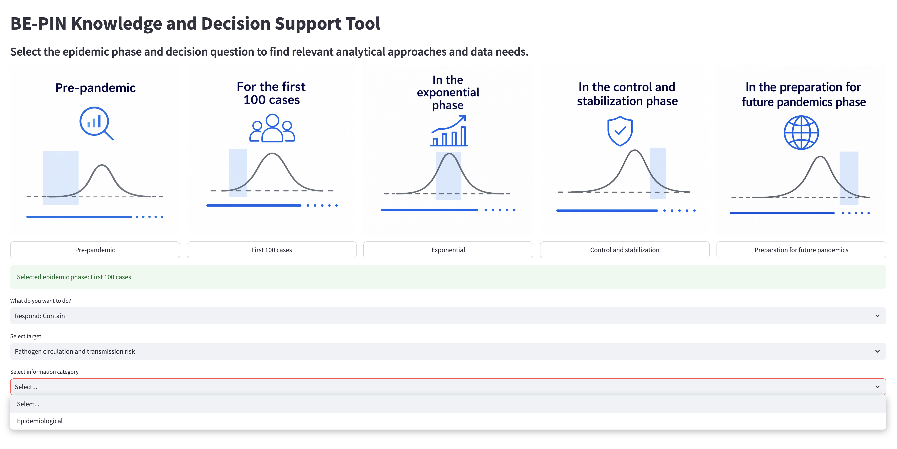
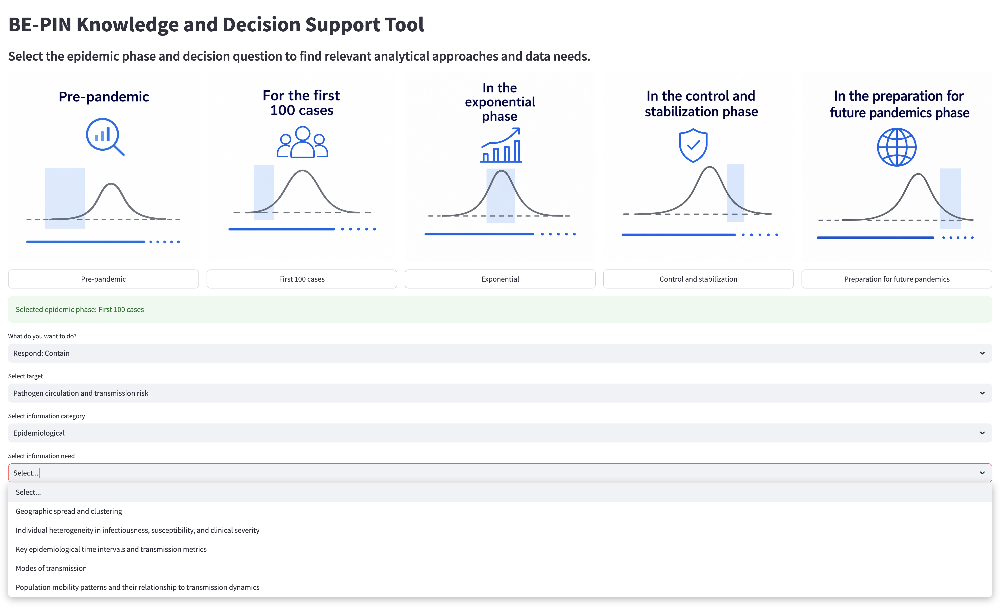
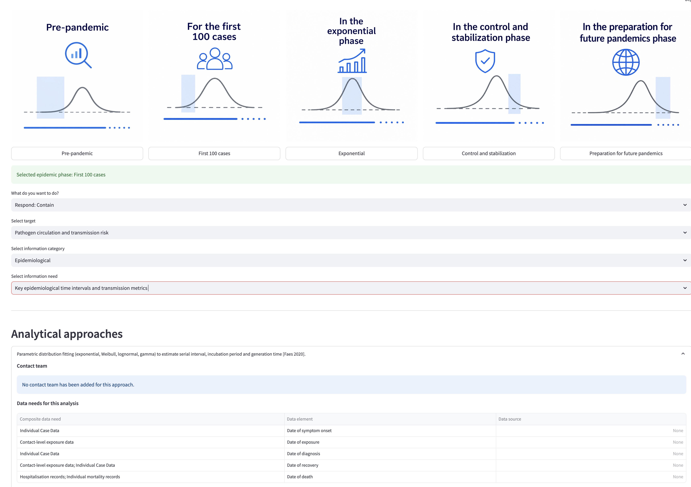

# Appendix 6.9 — Evidence Matrix Tool: Example Walkthrough

This appendix illustrates, step by step, how the BE-PIN Knowledge and Decision Support Tool is used to navigate from an epidemic phase and operational decision to the relevant analytical approach, contact team, and data needs.

## Step 1 — Select the pandemic phase

Users begin by selecting the epidemic phase relevant to their decision, from pre-pandemic through to preparation for future pandemics.

## Step 2 — Select the operational stage

Once a phase is selected (here, *First 100 cases*), the tool prompts the user to choose the operational stage, for example *Respond: Contain* or *Respond: Get ready*.

## Step 3 — Select the operational target

Next, the user selects the operational target associated with the chosen stage, for example *Pathogen circulation and transmission risk*.

## Step 4 — Select the information need domain

The user then selects the information category, or domain, relevant to the decision (for example, *Epidemiological*).

## Step 5 — Select the information need

Within the chosen domain, the tool lists the specific information needs available, such as *Key epidemiological time intervals and transmission metrics*.

## Step 6 — Obtain the suggested analytical approach, contact team, expert data needs requirements, and data source

Once an information need is selected, the tool displays the corresponding analytical approach(es), the contact team of experts (where available), and a table of the composite data needs, individual data elements, and data sources required for the analysis.

